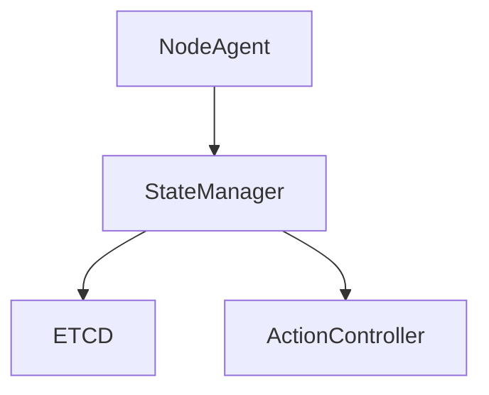
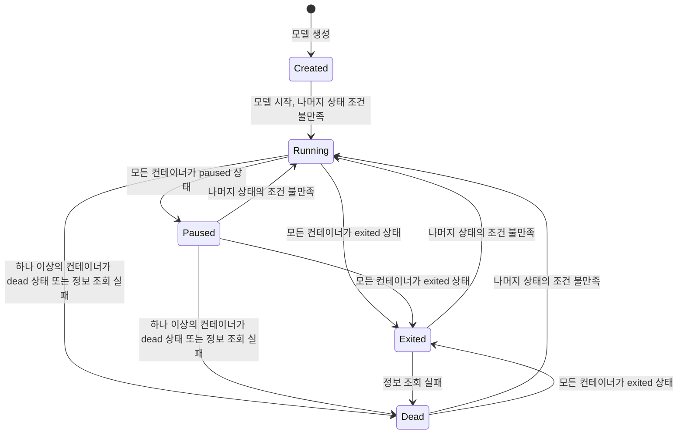
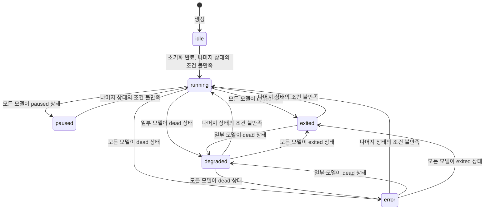

# StateManager 상세 설계 문서

**문서 번호**: PICCOLO-STATE-2025-001  
**버전**: 1.0  
**날짜**: 2025-09-11  
**작성자**: [작성자명]  
**분류**: HLD (High-Level Design)

## 1. 프로젝트 개요

**프로젝트 명**: StateManager  
**목적/배경**: StateManager는 각 resource의 state 변경 요청을 받아 실제 resource의 state를 변경하고, ETCD에 저장하는 역할을 수행한다. 각 컴포넌트들은 자신이 다루는 리소스의 상태를 변화시키기 위해 StateManager에게 요청한다.

**주요 기능**:
- resource의 state 변경 요청 수신 및 처리
- 상태 변경 결과 ETCD 저장
- 상태 변화에 따른 연쇄적 state 전이 관리
- package error 발생 시 ActionController에 reconcile 요청

**대상 사용자**: 시스템 내 resource 상태를 제어/관찰하는 모든 컴포넌트 및 개발자

### 1.1 목적
- resource 상태의 일관성 보장
- 상태 변화의 자동화 및 연쇄적 전이 관리
- 장애 발생 시 자동 복구 트리거 제공

### 1.2 주요 기능
1. **상태 변경 처리**
	- NodeAgent로부터 container/model의 상태 변화값 수신
	- 상태 별 변경 조건 만족 시 상태 변경
	- ETCD에 상태 저장
2. **연쇄적 상태 전이**
	- model의 상태 변화에 따라 package의 특정 상태 변경 조건을 만족시킬 경우 package의 상태도 연쇄적으로 변경
	- container의 상태 변화가 model의 특정 상태 변경 조건을 만족시킬 경우 model의 상태도 연쇄적으로 변경
3. **장애 복구 트리거**
	- package가 error 상태가 되면 ActionController에 reconcile 요청

### 1.3 적용 범위
- container, model(pod), package, scenario 등 주요 리소스의 상태 관리
- ETCD 기반 상태 저장 및 조회
- ActionController와의 연동

## 2. 사용 기술 및 환경
- 주요 언어/프레임워크: rust 등
- 기타 라이브러리/툴: ETCD, gRPC, REST API
- 배포/운영 환경: Linux 기반 서버, 클러스터 환경

## 3. 아키텍처

StateManager는 NodeAgent, ActionController, ETCD와 상호작용하며, 각 리소스의 상태를 관리한다.

### 3.1 시스템 구조

### 3.2 핵심 컴포넌트
| 컴포넌트 | 역할 | 상호작용 |
|----------|-----------------------------|----------------------|
| NodeAgent | container/model 상태 변화 감지 및 상태 변화값을 StateManager에게 전달 | StateManager |
| StateManager | 상태 변경 처리 및 저장, 연쇄적으로 상위 리소스의 상태 변경 | NodeAgent, ETCD, ActionController |
| ETCD | 데이터 저장소 | StateManager |
| ActionController | 장애 복구 트리거 처리 | StateManager |

### 3.3 기술 스택
| 계층 | 기술 | 설명 |
|------|------|------|
| 상태저장 | ETCD | 상태 정보 저장 |
| 통신 | gRPC/REST | 컴포넌트 간 통신 |
| 언어 | rust | 서비스 구현 |

## 4. 요구사항

### 4.1 기능적 요구사항
1. NodeAgent로부터 container/model의 상태 변화값을 수신한다.
2. 수신한 상태 변화값이 대상 resource의 상태 변경 조건을 만족시킬 경우 상태를 변경한다.
3. 상태 변경 결과를 ETCD에 저장한다.
4. container의 상태 변화가 model의 특정 상태 변경 조건을 만족시킬 경우 model의 상태도 연쇄적으로 변경한다. 
5. model의 상태 변화가 package의 특정 상태 변경 조건을 만족시킬 경우 package의 상태도 연쇄적으로 변경한다. 
5. 연쇄적인 상태 변경으로 인해 package가 dead 상태가 되면 ActionController에 reconcile을 요청한다.

### 4.2 비기능적 요구사항
1. **성능**: 상태 변경 요청에 대한 실시간 처리
2. **신뢰성**: 상태 정보의 일관성 보장
3. **확장성**: 리소스 및 상태 종류 확장 용이
4. **보안**: 상태 변경 요청의 인증 및 권한 관리

## 5. 주요 기능 상세

### 5.1 상태 변경 처리
- NodeAgent로부터 container/model의 상태 변화값을 수신
- 해당 리소스의 상태를 변경하고 ETCD에 저장
- 상태가 변경된 리소스의 상위 리소스 상태 변경 조건에 따라 연쇄적으로 상위 리소스의 상태도 변경

### 5.2 연쇄적 상태 전이 관계
- container의 상태 변경 → model의 상태 변경
- model의 상태 변경 → package의 상태 변경
- 각 상태 전이 조건은 state machine의 상태 별 조건에 따라 결정

### 5.3 장애 복구 트리거
- package의 상태가 dead 상태가 되면 ActionController에 reconcile 요청

## 6. 데이터 모델

### 6.1 리소스 정의
| 리소스 | 설명 |
|--------|------|
| container | 격리된 환경에서 실행하는 process |
| model(pod) | container들이 모여서 이룬 App |
| package | app들을 한번에 배포 및 제어하는 단위 |
| scenario | package 제어를 위한 명세서 |

### 6.2 상태 관리
#### model 상태 머신
| 상태 | 설명 |
|------|------|
| Created | 모델의 최초 상태 |
| Running | 나머지 상태의 조건을 불만족하는 경우 |
| Paused | 모든 컨테이너가 paused 상태일 때 |
| Exited | 모든 컨테이너가 exited 상태일 때 |
| Dead | 하나 이상의 컨테이너가 Dead 상태일 때 또는 정보 조회 실패 |

#### package 상태 머신
| 상태 | 설명 |
|------|------|
| idle | 맨 처음 package의 상태 |
| running | 나머지 상태의 조건을 불만족하는 경우 |
| paused | 모든 모델이 paused 상태일 때 |
| exited | 모든 모델이 exited 상태일 때 |
| degraded | 일부 모델이 dead 상태일 때 |
| error | 모든 모델이 dead 상태일 때 |

## 7. 인터페이스

### 7.1 내부 인터페이스
- NodeAgent → StateManager: container, pod의 상태 변화값 전달 (gRPC)
- StateManager → ETCD: 상태 저장/조회
- StateManager → ActionController: reconcile 요청

## 8. 성능 및 확장성
- 실시간 상태 변경 처리
- 리소스 및 상태 종류 확장 용이

## 9. 보안
- 상태 변경 요청 인증 및 권한 관리

## 10. 장애 처리 및 복구
- package dead 상태 시 복구 요청

## 11. 모니터링 및 로깅
- 상태 변경 이력 로깅
- 장애 및 복구 이벤트 모니터링

## 12. 배포 및 운영
- 클러스터 환경 배포
- ETCD, ActionController와 연동

## 13. 제약사항 및 한계
- 컨테이너 종류별 state machine 차이 존재
- ETCD 장애 시 상태 저장 불가

## 14. 향후 개선 계획
- 다양한 컨테이너 지원
- 상태 관리 자동화 고도화

## 15. 참고 자료
- [Podman 공식 문서]
- [ETCD 공식 문서]
- [gRPC 공식 문서]

## 부록
### A. 용어 정의
| 용어 | 정의 |
|------|------|
| ETCD | 분산 key-value 저장소 |
| NodeAgent | 각 노드의 상태 변화 감지 및 관리 에이전트 |
| ActionController | package action 실행 및 장애 복구 컴포넌트 |

### B. 변경 이력
| 버전 | 날짜 | 변경 내용 | 작성자 |
|------|------|----------|-------|
| 1.0 | 2025-09-11 | 최초 작성 | [작성자] |
