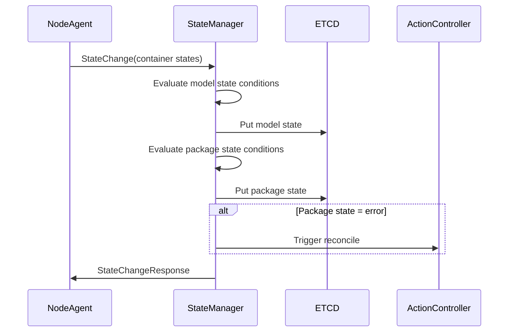
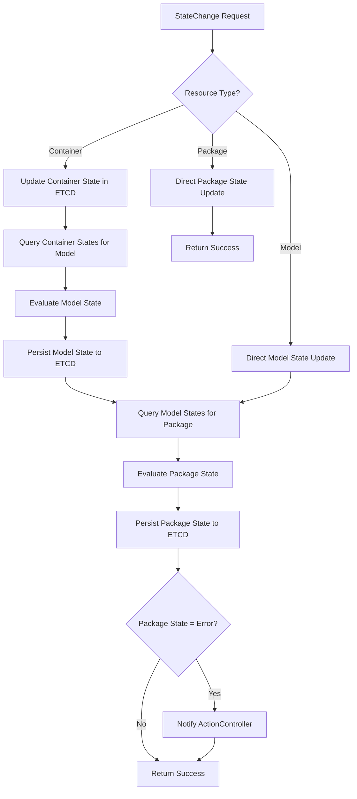

# StateManager Model Feature Implementation Design

**Document Version**: 1.0  
**Date**: 2024-12-22  
**Target Feature**: Model and Package State Management with Cascading Transitions

## 1. System Analysis

### 1.1 Existing Codebase Structure

Based on analysis of the current Pullpiri repository:

#### Core Components:
- **StateManager Service**: Located in `src/player/statemanager/`
  - `state_machine.rs`: Core state transition logic
  - `manager.rs`: StateManager service coordinator  
  - `grpc/receiver.rs`: gRPC interface implementation
  - `types.rs`: Data structures for state management

- **Common Library**: Located in `src/common/`
  - `etcd.rs`: ETCD client operations (put, get, delete)
  - `lib.rs`: Protocol buffer definitions and service endpoints
  - `proto/statemanager.proto`: gRPC service definitions

#### Current State:
- Basic state machine framework exists with transition tables
- gRPC interface for receiving StateChange requests is implemented
- ETCD integration exists for basic operations
- Model and Package state enums are defined in protobuf

#### Architectural Patterns:
- **Event-driven**: StateManager processes StateChange messages asynchronously
- **Table-driven state machine**: Uses transition tables per resource type
- **Microservices**: gRPC communication between components
- **ETCD-based persistence**: Distributed key-value storage for state

### 1.2 Missing Implementation

From the LLD analysis, these key features need implementation:
1. **Model state evaluation logic** based on container states
2. **Package state evaluation logic** based on model states  
3. **Cascading state transitions** (container → model → package)
4. **ETCD state persistence** with proper key formatting
5. **Error recovery triggers** for ActionController

## 2. Feature Integration Plan

### 2.1 Integration Points

The new Model functionality will integrate with:

1. **Existing StateMachine**: Extend `process_state_change()` method
2. **ETCD Operations**: Use existing `common::etcd` module functions
3. **gRPC Interface**: Leverage existing `StateManagerConnection` service
4. **Error Handling**: Utilize existing `ErrorCode` enum and `TransitionResult`

### 2.2 Component Interaction Flow



## 3. Component Breakdown

### 3.1 New Components/Functions

#### 3.1.1 Model State Evaluation
- **Location**: `src/player/statemanager/src/state_machine.rs`
- **Function**: `evaluate_model_state_from_containers(&self, model_name: &str, container_states: &HashMap<String, String>) -> ModelState`
- **Purpose**: Determine model state based on container state conditions

#### 3.1.2 Package State Evaluation  
- **Location**: `src/player/statemanager/src/state_machine.rs`
- **Function**: `evaluate_package_state_from_models(&self, package_name: &str, model_states: &HashMap<String, ModelState>) -> PackageState`
- **Purpose**: Determine package state based on model state conditions

#### 3.1.3 Cascading State Manager
- **Location**: `src/player/statemanager/src/state_machine.rs`
- **Function**: `handle_cascading_transitions(&mut self, state_change: &StateChange) -> Vec<StateChange>`
- **Purpose**: Generate cascading state changes for parent resources

#### 3.1.4 State Persistence Manager
- **Location**: `src/player/statemanager/src/state_machine.rs`
- **Function**: `persist_state_to_etcd(&self, resource_type: ResourceType, resource_name: &str, state: &str) -> Result<(), Error>`
- **Purpose**: Save state changes to ETCD with proper key formatting

#### 3.1.5 Container State Query
- **Location**: `src/player/statemanager/src/state_machine.rs`
- **Function**: `get_container_states_for_model(&self, model_name: &str) -> Result<HashMap<String, String>, Error>`
- **Purpose**: Query ETCD for container states belonging to a model

#### 3.1.6 Model State Query
- **Location**: `src/player/statemanager/src/state_machine.rs`  
- **Function**: `get_model_states_for_package(&self, package_name: &str) -> Result<HashMap<String, ModelState>, Error>`
- **Purpose**: Query ETCD for model states belonging to a package

### 3.2 Enhanced Components

#### 3.2.1 Enhanced StateMachine.process_state_change()
- **Enhancement**: Add Model and Package state evaluation logic
- **New Logic**: Cascading transitions and ETCD persistence

#### 3.2.2 Enhanced ETCD Key Management
- **Enhancement**: Standardize key formats per LLD requirements
- **Keys**: `/model/{name}/state`, `/package/{name}/state`, `/container/{name}/state`

## 4. Implementation Sequence

### Phase 1: Core State Evaluation Functions (Tasks 1-2)
1. **Implement Model State Evaluation Logic**
   - Create `evaluate_model_state_from_containers()` method
   - Implement state transition rules from LLD Table 3.2
   - Add unit tests for all state conditions

2. **Implement Package State Evaluation Logic**  
   - Create `evaluate_package_state_from_models()` method
   - Implement state transition rules from LLD Table 3.1
   - Add unit tests for all state conditions

### Phase 2: ETCD Integration (Tasks 3-4)
3. **Implement State Persistence**
   - Create `persist_state_to_etcd()` method using proper key formats
   - Add error handling and logging
   - Add unit tests with mock ETCD

4. **Implement State Query Functions**
   - Create `get_container_states_for_model()` method
   - Create `get_model_states_for_package()` method  
   - Add unit tests with mock data

### Phase 3: Cascading Logic (Tasks 5-6)
5. **Implement Cascading State Transitions**
   - Create `handle_cascading_transitions()` method
   - Integrate with existing `process_state_change()` logic
   - Add comprehensive integration tests

6. **Implement Error Recovery Integration**
   - Add ActionController notification for package error states
   - Implement retry logic for failed state transitions
   - Add monitoring and logging

### Phase 4: Integration and Testing (Tasks 7-8)  
7. **Integration with Existing StateMachine**
   - Enhance `process_state_change()` to use new functions
   - Ensure backward compatibility with existing functionality
   - Add comprehensive integration tests

8. **Documentation and Validation**
   - Update code documentation and examples
   - Create usage examples in documentation
   - Validate with end-to-end scenarios

## 5. Interface Definitions

### 5.1 Model State Evaluation

```rust
impl StateMachine {
    /// Evaluate model state based on container states according to LLD Table 3.2
    /// 
    /// # Arguments
    /// * `model_name` - Name of the model to evaluate
    /// * `container_states` - Map of container name to state string
    /// 
    /// # Returns
    /// * `ModelState` - The evaluated state based on LLD conditions
    /// 
    /// # State Conditions (LLD Table 3.2)
    /// - Created: Model's initial state
    /// - Paused: All containers are paused
    /// - Exited: All containers are exited  
    /// - Dead: One or more containers are dead OR model info query failed
    /// - Running: Default state when other conditions not met
    pub fn evaluate_model_state_from_containers(
        &self, 
        model_name: &str, 
        container_states: &HashMap<String, String>
    ) -> ModelState;
}
```

### 5.2 Package State Evaluation

```rust
impl StateMachine {
    /// Evaluate package state based on model states according to LLD Table 3.1
    /// 
    /// # Arguments  
    /// * `package_name` - Name of the package to evaluate
    /// * `model_states` - Map of model name to ModelState
    /// 
    /// # Returns
    /// * `PackageState` - The evaluated state based on LLD conditions
    /// 
    /// # State Conditions (LLD Table 3.1)
    /// - idle: Initial package state
    /// - paused: All models are paused
    /// - exited: All models are exited
    /// - degraded: Some (1+) models are dead, but not all
    /// - error: All models are dead  
    /// - running: Default state when other conditions not met
    pub fn evaluate_package_state_from_models(
        &self, 
        package_name: &str, 
        model_states: &HashMap<String, ModelState>
    ) -> PackageState;
}
```

### 5.3 ETCD Persistence

```rust
impl StateMachine {
    /// Persist resource state to ETCD with standardized key format
    /// 
    /// # Arguments
    /// * `resource_type` - Type of resource (Model, Package, etc.)
    /// * `resource_name` - Name of the resource instance
    /// * `state` - State string to persist
    /// 
    /// # ETCD Key Formats (per LLD)
    /// - Model: `/model/{name}/state`
    /// - Package: `/package/{name}/state`  
    /// - Container: `/container/{name}/state`
    /// 
    /// # Returns
    /// * `Result<(), Error>` - Success or ETCD error
    pub async fn persist_state_to_etcd(
        &self,
        resource_type: ResourceType,
        resource_name: &str, 
        state: &str
    ) -> Result<(), etcd_client::Error>;
}
```

### 5.4 Error Handling

All functions will use consistent error handling:
- **ETCD errors**: Propagate `etcd_client::Error` with context
- **Validation errors**: Return `ErrorCode::InvalidRequest` 
- **State transition errors**: Return `ErrorCode::InvalidStateTransition`
- **Logging**: Use `eprintln!` for errors, `println!` for info (consistent with existing code)

## 6. Data Flow Diagram



## 7. State Transition Rules Implementation

### 7.1 Model State Rules (LLD Table 3.2)

```rust
// Model state evaluation logic
match container_states {
    // All containers paused -> Model Paused
    states if states.values().all(|s| s == "paused") => ModelState::Paused,
    // All containers exited -> Model Exited  
    states if states.values().all(|s| s == "exited") => ModelState::Exited,
    // Any container dead OR query failed -> Model Dead
    states if states.values().any(|s| s == "dead") => ModelState::Dead,
    // Default -> Model Running
    _ => ModelState::Running,
}
```

### 7.2 Package State Rules (LLD Table 3.1)

```rust  
// Package state evaluation logic
let dead_count = model_states.values().filter(|&s| *s == ModelState::Dead).count();
let total_count = model_states.len();

match (dead_count, total_count) {
    // All models paused -> Package Paused
    _ if model_states.values().all(|s| *s == ModelState::Paused) => PackageState::Paused,
    // All models exited -> Package Exited
    _ if model_states.values().all(|s| *s == ModelState::Exited) => PackageState::Exited,
    // All models dead -> Package Error
    (dead, total) if dead == total && total > 0 => PackageState::Error,
    // Some models dead -> Package Degraded  
    (dead, _) if dead > 0 => PackageState::Degraded,
    // Default -> Package Running
    _ => PackageState::Running,
}
```

## 8. Testing Strategy

### 8.1 Unit Tests

Each new function will have comprehensive unit tests covering:
- **Happy path scenarios**: Valid state transitions
- **Edge cases**: Empty container/model lists, invalid states
- **Error conditions**: ETCD failures, malformed data
- **State transition rules**: All conditions from LLD tables

### 8.2 Integration Tests

- **Cascading transitions**: Container → Model → Package
- **ETCD persistence**: State correctly saved and retrieved
- **Error recovery**: ActionController notification on package errors
- **Backward compatibility**: Existing functionality unaffected

### 8.3 Test Data

Mock data sets representing various real-world scenarios:
- Normal operation with mixed container states
- Failure scenarios with dead containers/models
- Recovery scenarios with state transitions

## 9. Performance Considerations

### 9.1 ETCD Query Optimization
- **Prefix queries**: Use `get_all_with_prefix()` for efficient bulk retrieval
- **Caching**: Consider in-memory cache for frequently accessed states
- **Batch operations**: Group related ETCD operations where possible

### 9.2 State Evaluation Efficiency  
- **Early termination**: Short-circuit evaluation where possible
- **Minimal queries**: Only query ETCD when state changes are detected
- **Async operations**: Use async/await for ETCD operations to avoid blocking

## 10. Security and Reliability

### 10.1 Data Validation
- **Input sanitization**: Validate all resource names and state values
- **State consistency**: Verify state transitions are logically valid
- **ETCD key validation**: Ensure proper key formatting and escaping

### 10.2 Error Recovery
- **Retry logic**: Implement exponential backoff for ETCD failures
- **Graceful degradation**: Continue operation with cached state if ETCD unavailable
- **Audit logging**: Log all state changes for debugging and compliance

## 11. Implementation Notes

### 11.1 Code Style Consistency
- Follow existing code patterns in `state_machine.rs`
- Use consistent error handling with `eprintln!` and `ErrorCode` enums
- Maintain comprehensive inline documentation
- Follow Rust naming conventions and ownership patterns

### 11.2 Backward Compatibility
- All changes must maintain existing API compatibility
- New functionality should be additive, not replacing existing logic
- Existing tests must continue to pass

### 11.3 Configuration
- Use existing ETCD configuration from `common::etcd`
- No new configuration parameters required
- Leverage existing gRPC port and endpoint configuration

This design provides a comprehensive roadmap for implementing the Model and Package state management functionality according to the HLD/LLD requirements while maintaining consistency with the existing Pullpiri architecture.